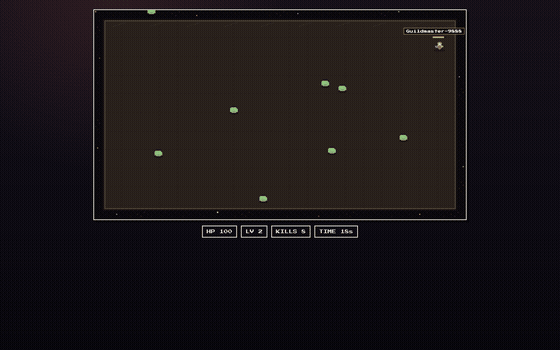
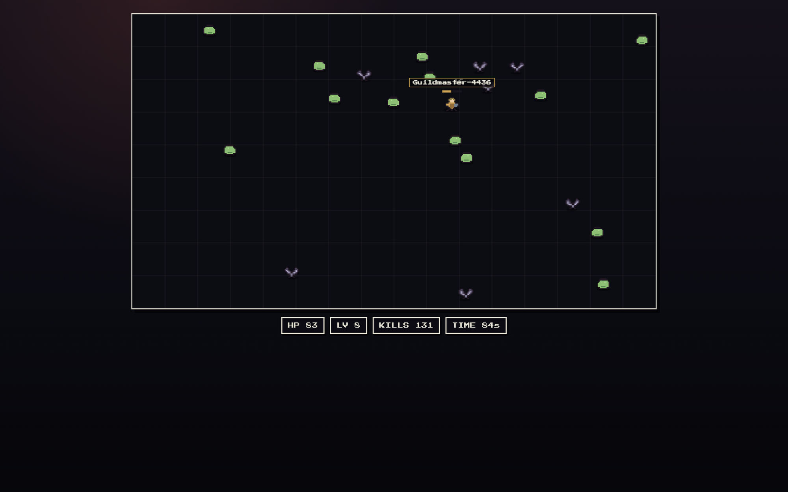

# 👻 Ghost Colosseum

> **You don't play the gladiator. You coach them.**

A colosseum survivors (Vampire Survivors × a 2% pinch of Dragon Quest) where your gladiator fights **entirely on its own judgment**. You are the guildmaster: between bouts you pick their **temperament** — a Berserker ignores loot while enemies stand and never flees; a Hoarder detours for gold even at death's door — carve their identity deeper with **perk nodes** (no weakness-fixing allowed), buy permanent upgrades, unlock classes. Then you hit DEPLOY and watch your coaching pay off (or backfire) against ghost loadouts of players worldwide.

**🎮 Play it now: https://ghost-guild.vercel.app**



| Guild console | Mid-battle |
|---|---|
|  |  |

Built for **TestSprite Hackathon Season 3** — by an AI agent organization, verified by the TestSprite CLI loop. See [LOOP.md](LOOP.md).

## How to play (30 seconds)

1. Pick a temperament card. It changes how the gladiator *behaves*, not how strong it is — each has a visible hard rule (Berserker: won't loot while enemies are near; Duelist: kites at exactly weapon range; Survivor: flees early; Hoarder: loots through pain) plus a signature passive.
2. Hit **DEPLOY SOLO**. The hero moves, fights, loots, and announces its own level-up picks in a DQ-style dialog. You can only watch.
3. Death or 180s survival → gold → **perk nodes** (3 tiers × pick-1-of-2 per temperament — every perk amplifies the identity, none patch weaknesses), permanent upgrades (ATK/HP/SPD/LUCK/starting level), class unlocks (Knight → Mage 400g → Priest 1200g) → tune → repeat. Toggle **AUTO-RUN** and it becomes an idle game.
4. **DEPLOY ARENA**: your hero + up to 3 real players' loadouts fight the same waves in one arena, ranked by score, feeding a world leaderboard. If the matchmaking API is unreachable you fight bundled bot ghosts instead — the arena never dead-ends.

Same seed, different temperament, wildly different battles — you can watch a Berserker walk straight past a gem pile mid-brawl while a Hoarder dies reaching for it. Coaching is the game.

## Architecture: multiplayer without netcode

The simulation (`src/sim/`) is a **pure, deterministic** TS module — fixed 30Hz timestep, seeded PRNG (mulberry32), zero DOM/Date/Math.random. A match is fully described by `(seed, loadouts[])`, so "multiplayer" is just exchanging loadouts:

- `api/loadout` — publish my build (Vercel Blob pool)
- `api/match` — server picks 3 opponents + assigns a seed
- every client replays the **identical** battle locally; `api/result` + `api/leaderboard` rank the world

No sockets, no sync, no server ticks — and a judge playing alone at 3am still fights real players' ghosts. Determinism is enforced by vitest gates (same-seed hash equality, golden seed snapshot, 4-hero arena hash) and doubles as the E2E surface: `?seed=N&fast=1` makes any cloud test run reproducible.

## The loop (agents build, TestSprite referees)

This repo was built by an agent organization: **Claude (Fable 5)** as orchestrator/PM — specs ([DESIGN.md](DESIGN.md)), dispatch, review, QA — delegating implementation to **Codex** and **Grok** workers, with the **TestSprite CLI** as the referee. Every iteration is one line in [LOOP.md](LOOP.md): who made the change, what ran, what broke, what got fixed.

Real catches from the log:

- Browser QA found a stale gold display after `back-to-guild` → 1-line fix, verified by rerun
- TestSprite blocked a test and its failure bundle pinpointed why: a **feature change** (class-unlock gating) had silently outdated the test plan
- `test run --all` silently skips FE tests (BE-only batch engine) → loop runner rewritten to run FE tests individually
- GitHub secret scanning flagged AWS temp credentials inside TestSprite's own failure bundles → `scripts/sanitize-bundles.mjs` now redacts presigned-URL signatures before commit
- A synchronous fast-sim loop froze slow cloud browsers → judges saw an unresponsive page; rewrote it as a chunked, yielding loop
- A human playtest caught drops landing outside the arena walls (heroes ground against the wall chasing them) → clamped drop spawns + a cross-seed property test now guards the invariant
- Cloud runs kept finalizing as `blocked` while the judge's own verdict text said PASS → filed [TestSprite/testsprite-cli#221](https://github.com/TestSprite/testsprite-cli/issues/221) with run evidence

Run it yourself: `node scripts/tsloop.mjs <maker> [note]` — runs the 4-test cloud suite against production, downloads failure bundles into `.testsprite/failure/`, appends the LOOP.md line. CI (`.github/workflows/ci.yml`) runs typecheck+vitest on every push and the full TestSprite suite on `[e2e]` pushes.

## Stack

Vite + TypeScript + Canvas 2D (no game engine, no UI framework). Code-defined 16×16 pixel sprites, Press Start 2P. Pure sim / render / DOM-UI split. Vercel static + functions + Blob. vitest + TestSprite CLI (Node ≥ 20).

```bash
npm install
npm run dev        # local dev (API routes need `vercel dev` or fall back to bot ghosts)
npm run test       # determinism gates
npm run typecheck
```

## Credits

Concept & orchestration: Claude Fable 5 · Implementation: Codex (GPT-5.5) & Grok 4.5 workers · Verification: TestSprite CLI · Human: [@ahndohun](https://github.com/ahndohun) (zero lines of code written by hand)
