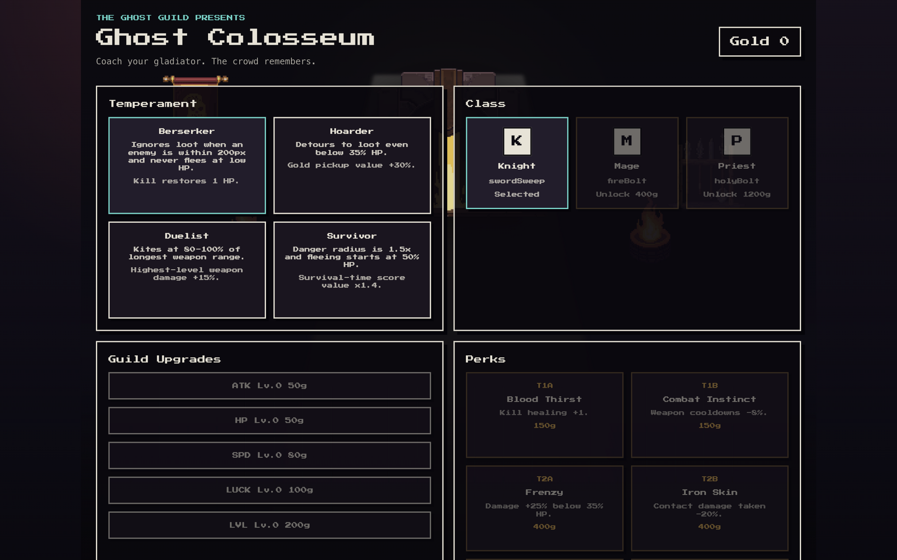
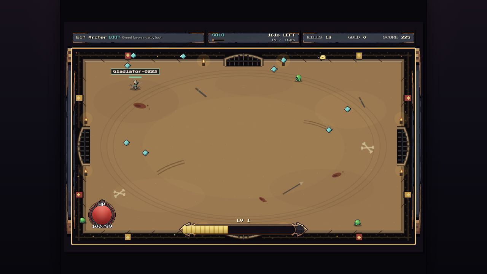

# ⚔️ Colosseum Survivors

[](https://github.com/ahndohun/ghost-guild/actions/workflows/ci.yml)

> **You don't play the gladiator. You coach them.**

**Colosseum Survivors** is an autonomous arena-survival game (Vampire Survivors × a 2% pinch of Dragon Quest) where your gladiator fights **entirely on its own judgment**. Between bouts you choose a class, forge its specialization tree, equip recovered items, and buy permanent upgrades. Then you press **ENTER THE ARENA** and watch your coaching pay off—or backfire—against the arena and asynchronous rival builds.

**🎮 Play it now: https://colosseum-survivors.pages.dev**

| Barracks & build | Autonomous Elf Archer run |
|---|---|
|  |  |

Built for **TestSprite Hackathon Season 3** — by an AI agent organization, verified by the TestSprite CLI loop. See [LOOP.md](LOOP.md).

## How to play (30 seconds)

1. Pick any of **11 free classes** from the always-visible two-row roster. A class defines stats, starting skills, signature rules, and autonomous behavior—from the steady Fighter and immovable Knight to the rapid-fire **Elf Archer**, loot-driven Thief, and one-weapon Monk.
2. In **Class & Tree**, forge a class-specific specialization: **5 tiers × pick 1 of 2**, with progress preserved per class. Use **Training** for permanent ATK/HP/SPD/LUCK/starting-level upgrades and **Inventory** to compare recovered relic weapons, armor, and trinkets.
3. Press **ENTER THE ARENA → PRACTICE BOUT**. The gladiator moves, fights, loots, and chooses level-up options without direct control while you read the battle. Death or surviving the full 180 seconds returns a truthful run report, earned gold, and recovered loot. **AUTO-RUN** lives in this same bout menu.
4. Choose **GRAND BOUT** to place your build beside up to three rival saved loadouts on the same deterministic waves, ranked by score with results feeding a world leaderboard. If matchmaking is unavailable, bundled offline rivals keep the arena playable.

Same seed, different class and specialization, wildly different battles: a Berserker stays locked in combat while a Thief bends its route toward loot. Coaching is the game.

## Architecture: multiplayer without netcode

The simulation (`src/sim/`) is a **pure, deterministic** TS module — fixed 30Hz timestep, seeded PRNG (mulberry32), zero DOM/Date/Math.random. A match is fully described by `(seed, loadouts[])`, so "multiplayer" is just exchanging loadouts:

- `api/loadout` — publish my build (Vercel Blob pool)
- `api/match` — server picks 3 opponents + assigns a seed
- every client replays the **identical** battle locally; `api/result` + `api/leaderboard` rank the world

No sockets, no sync, no server ticks—and a judge playing alone at 3am still fights recorded builds from real players. Determinism is enforced by vitest gates (same-seed hash equality, golden seed snapshot, 4-hero arena hash) and doubles as the E2E surface: `?seed=N&fast=1` makes any cloud test run reproducible.

## The loop (agents build, TestSprite referees)

This repo was built by an agent organization: **Claude (Fable 5)** as orchestrator/PM — specs ([DESIGN.md](DESIGN.md)), dispatch, review, QA — delegating implementation to **Codex** and **Grok** workers, with the **TestSprite CLI** as the referee. Every iteration is one line in [LOOP.md](LOOP.md): who made the change, what ran, what broke, what got fixed.

Real catches from the log:

- Browser QA found a stale gold display after `back-to-guild` → 1-line fix, verified by rerun
- TestSprite blocked a test and its failure bundle pinpointed why: a **feature change** (class-unlock gating) had silently outdated the test plan
- `test run --all` silently skips FE tests (BE-only batch engine) → loop runner rewritten to run FE tests individually
- GitHub secret scanning flagged AWS temp credentials inside TestSprite's own failure bundles → `scripts/sanitize-bundles.mjs` now redacts presigned-URL signatures before commit
- A synchronous fast-sim loop froze slow cloud browsers → judges saw an unresponsive page; rewrote it as a chunked, yielding loop
- A human playtest caught drops landing outside the arena walls (heroes ground against the wall chasing them) → clamped drop spawns + a cross-seed property test now guards the invariant
- Cloud runs kept finalizing as `blocked` while the judge's own verdict text said PASS → filed [TestSprite/testsprite-cli#221](https://github.com/TestSprite/testsprite-cli/issues/221) with run evidence

Run it yourself: `node scripts/tsloop.mjs <maker> [note]` — runs the 4-test cloud suite against production, downloads failure bundles into `.testsprite/failure/`, appends the LOOP.md line. CI (`.github/workflows/ci.yml`) runs typecheck+vitest on every push and the full TestSprite suite on `[e2e]` pushes.

## Stack

Vite + TypeScript + Canvas 2D (no game engine, no UI framework). Manifest-driven pixel-art assets and directional actor atlases, produced through a PixelLab pipeline and rendered with nearest-neighbor scaling; Press Start 2P supplies the UI type. Pure sim / render / DOM-UI split. Vercel static + functions + Blob. vitest + TestSprite CLI (Node ≥ 20).

```bash
npm install
npm run dev        # local dev (API routes need `vercel dev` or fall back to offline rivals)
npm run test       # determinism gates
npm run typecheck
```

## Credits

Concept & orchestration: Claude Fable 5 · Implementation: Codex (GPT-5.5) & Grok 4.5 workers · Verification: TestSprite CLI · Human: [@ahndohun](https://github.com/ahndohun) (zero lines of code written by hand)

Music: "8 bit battle theme" by celestialghost8 (CC0, OpenGameArt)
